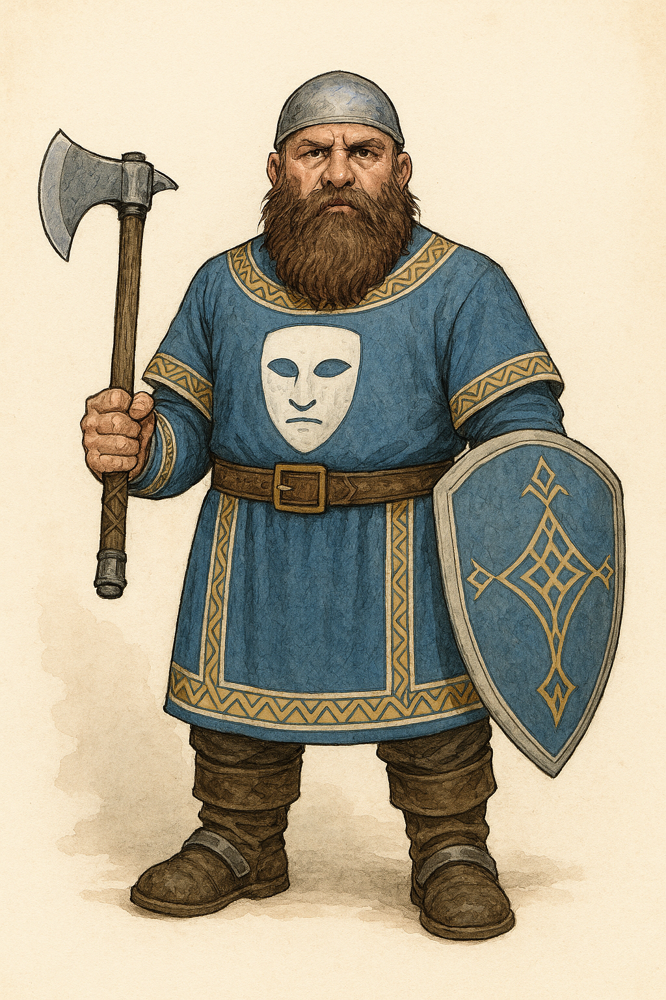

# Brynn Stormgrove

- **Alias**: Brynn
- **Typ**: dnd-pc
- **Sichtbarkeit**: public
- **Status**: published
- **Spoiler-Level**: none
- **Tags**: dnd-pc, greyhawk-campaign

{: height="250" }

## Ueberblick

- **Spezies**: Zwerg
- **Klasse**: Paladin
- **Groesse**: 1,39 m
- **Hintergrund**: Aufgewachsen in den Crystalmist Mountains
- **Markante Feature**: Ruhiger Auftreten, disziplinierte Haltung
- **Alter**: 58 Jahre

## Iconic sayings

- "Bitte leg die Waffen nieder."

## History

Brynn verfolgt einen Weg von Selbstdisziplin, Verantwortung und Schutz der Schwachen. Er ist als verlaesslicher Frontkaempfer und Vermittler bekannt.

## Motivation und Ziele

- Konflikte moeglichst ohne Eskalation loesen.
- Die Gruppe sicher durch gefaehrliche Lagen fuehren.

## Beziehungen

- Hat Bindungen zu frueheren Weggefaehrten aus den Bergen.

## Equipment

- Schild, Hammer, Reiseausruestung.

## Tags

- #dnd-pc
- #greyhawk-campaign