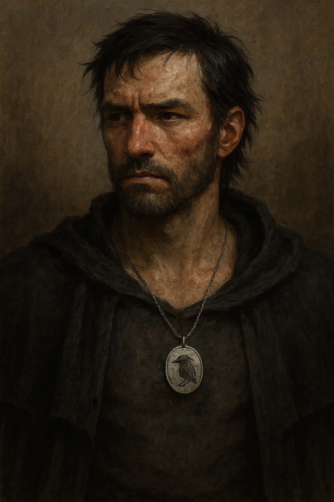

# Der Rabe

- **Alias**: Rabe
- **Typ**: dnd-pc
- **Sichtbarkeit**: public
- **Status**: published
- **Spoiler-Level**: none
- **Tags**: dnd-pc, greyhawk-campaign

{: height="250" }

## Ueberblick

- **Spezies**: Halb-Elf
- **Klasse**: Warlock
- **Groesse**: 1,79 m
- **Hintergrund**: Unvollstaendige Erinnerungen an die eigene Vergangenheit
- **Markante Feature**: Auffaellige Geruchs- und Geschmackswahrnehmung
- **Alter**: Etwa 40 Jahre

## Iconic sayings

- "Ich kenne den Namen nicht mehr, aber deinen Geruch vergesse ich nicht."

## History

Der Rabe tritt als verschlossener, aber loyaler Reisegefaehrte auf. Seine Erinnerungsbrueche praegen sein Verhalten und seine Entscheidungen.

## Motivation und Ziele

- Bruchstuecke der eigenen Vergangenheit einordnen.
- Die Gruppe trotz innerer Konflikte schuetzen.

## Beziehungen

- Sucht Vertrauen in kleinen, verlaesslichen Schritten.

## Equipment

- Reiseausruestung und persoenliche Andenken.

## Tags

- #dnd-pc
- #greyhawk-campaign