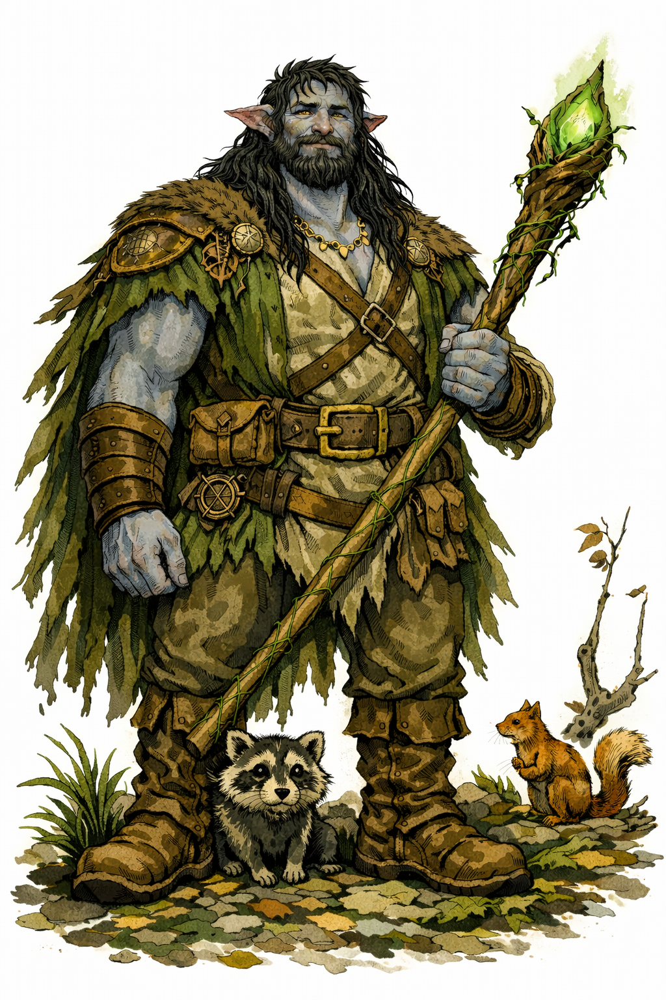

# Inti

{: height="250" }

## Überblick

- **Spezies**: Firbolg
- **Klasse**: Druid (Circle of the Moon)
- **Größe**: 2,13 m
- **Hintergrund**: City Watch > Forest Watch
- **Markantes Feature**: Sein Name bedeutet "Sonne"; so hat ihn seine Mutter genannt.
- **Alter**: 125 (von 500)

## Iconic Sayings

- "Die Sonne eilt nicht, und trotzdem erreicht sie jeden Baum."

## History

-

## Motivation und Ziele

-

## Beziehungen

- Titus Wenner, ehemaliger Vorarbeiter einer Holzfällergruppe.
- Will vom Mühlteich, Gastwirt.

## Journals

- Character Journal 05.05.26 (Inti)

## Equipment

-