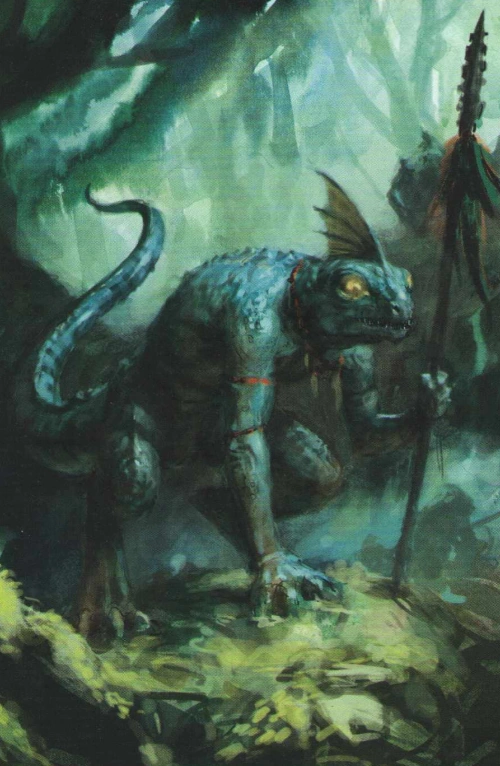

# Jawsh

{: height="250" }

## Überblick

- **Spezies**: Lizardfolk
- **Klasse**: Ranger
- **Größe**: Größer als ein durchschnittlicher Human, kleiner als ein durchschnittlicher Lizardfolk Guard/Warrior
- **Hintergrund**: Guide; kommt aus Zassil'torr
- **Markantes Feature**: Blue scales, golden eyes, tribe symbols and hunting trophies as accessories (bones)
- **Alter**: 27 Jahre

## Iconic Sayings

- "Wenn es blutet, findet der Sumpf den Rest."

## History

- Description: Blue scales, golden eyes, tribe symbols and hunting trophies as accessories (bones).
- Level: 1
- Class skills: Animal Handling, Investigation, Athletics
- Class features:
  - Favored Enemy: Hunter's Mark 2/Long Rest
  - Weapon Mastery: Shortsword, Scimitar
  - Spellcasting: Ensnaring Strike, Cure Wounds
  - Speed: walking speed 30 feet, swimming speed equal to walking speed
  - Nature's Intuition: Nature, Perception
  - Languages: Common und eine weitere passende Sprache (notiert als "bad common" und lizardfolk-spezifische Sprache)
- Racial traits:
  - Natural Armor: AC = 13 + Dex
  - Hungry Jaws
  - Bite
  - Hold Breath (bis zu 15 Minuten)
- Ability Scores: Dex, Con, Wis
- Feat: Magic Initiate (Druid) (Level-1-Spell: Healing Word; Cantrips: Produce Flame, Guidance)
- Skill Proficiencies: Stealth und Survival
- Tool Proficiency: Cartographer's Tools
- Stats:
  - STR 12
  - DEX 16
  - CON 14
  - INT 8
  - WIS 16
  - CHA 8

## Motivation und Ziele

-

## Beziehungen

-

## Journals

-

## Equipment

- Scimitar 25 GP
- Shortsword 10 GP
- Heavy Crossbow 50 GP
- Arrows + quiver (20 ammunition) 2 GP
- Map 1 GP
- Cartographer's Tools 15 GP
- Potion of Healing 50 GP
- Dungeoneer's Pack 12 GP
- Druidic Focus (totem necklace) 1 GP
- Ink pen, 10 sheets of parchment, ink 12 GP