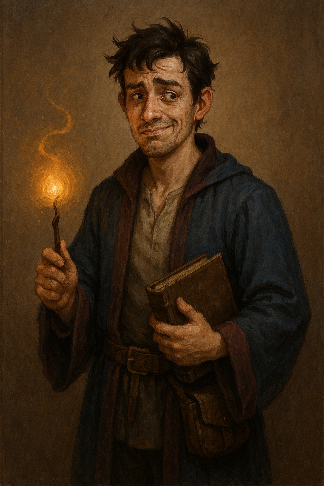

# Lys Waldstieg

- **Alias**: Lys

{: height="250" }

## Überblick

- **Spezies**: Human
- **Klasse**: Wizard
- **Größe**: 1,76 m
- **Hintergrund**: Geburtsort Dorf nahe Greyhawk; echte Abstammung Haus Velmire; Aufenthalt im gehobenen Viertel nahe der Magierakademie
- **Markantes Feature**: legt viel Wert auf Sauberkeit
- **Alter**: 23 Jahre

## Iconic Sayings

- "Natürlich habe ich das gewusst. Ich wollte nur sehen, ob ihr es auch merkt."

## History

- Gimmick: notorischer Lügner, der sich durch übertriebene Behauptungen und falsche Fachbegriffe hervortut.
- Deckidentität: angeblich Sohn eines Jägers aus dem Armenviertel; eigentlich Lysander Velmire.
- Typische Lügen:
  - Eltern finanzierten den Akademiebesuch und starben bei einem Überfall.
  - Rückkehr von der Beerdigung vor wenigen Tagen.
  - Eltern waren einfache Waldleute/Jäger.
- Verhalten:
  - Überkompensiert durch Angeberei.
  - Nutzt Magie, um handwerkliche Defizite zu kaschieren.
  - Verwendet Fachbegriffe falsch, um Kompetenz vorzutäuschen.
- Fall aus der Gnade: politischer Skandal, Enteignung, gesellschaftliche Ächtung.
- Zeitlicher Ablauf:
  - Fall des Hauses vor wenigen Wochen.
  - Austritt aus der Akademie vor wenigen Tagen (wegen Geldmangel).
  - Jetzt auf der Suche nach schnellem Geld und neuer Identität.
- Innerer Konflikt:
  - Scham über den sozialen Abstieg seiner Familie.
  - Angst vor Entlarvung seiner falschen Identität.
  - Zerrissenheit zwischen dem Wunsch nach Wahrheit und dem Zwang zur Lüge.
  - Identitätskrise: Je länger er lügt, desto mehr verliert er sich selbst.

## Motivation und Ziele

- Kurzfristig: Anerkennung durch eigene Leistung, auch wenn sie auf Lügen basiert.
- Mittelfristig: Zugang zu elitären oder verbotenen magischen Kreisen.
- Langfristig: Wiederherstellung des Familiennamens und Aufdeckung der wahren Hintergründe des Skandals.

## Beziehungen

-

## Journals

- Character Journal 31.03. (Lys)

## Equipment

- Cloak of Many Fashions