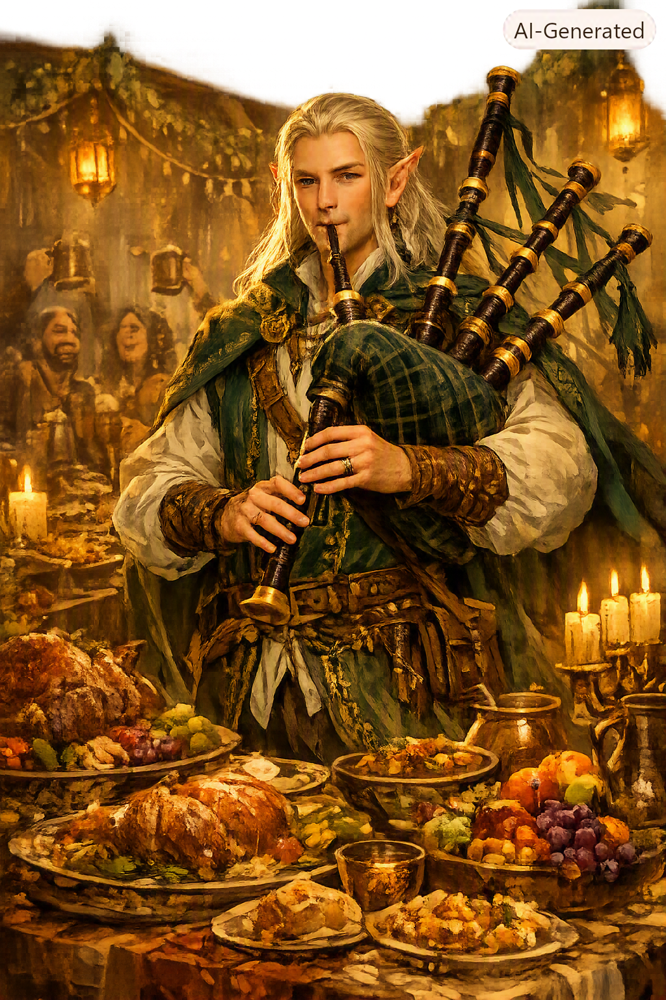

# Meane

{: height="250" }

## Überblick

- **Spezies**: Hochelf
- **Klasse**: Barde (Schwerpunkt Gesang und soziale Harmonie)
- **Größe**: 1,84 m
- **Hintergrund**: Verbannter Künstler / Reisender Koch
- **Markantes Feature**: Vergesslich, zeitentrückt, möchte durch Kochen und Gesang Gemeinschaft stiften
- **Alter**: schon etwas älter

## Iconic Sayings

- "Setz dich, iss etwas, und für einen Augenblick ist die Welt freundlicher."

## History

- Geboren auf den Lendore Isles als Teil der High-Elves.
- Stammt aus einem abgelegenen Waldreich der Hochelfen.
- Sein Volk lebt traditionell abgeschottet, naturverbunden und folgt strengen Regeln, darunter einem Verbot des Tötens und Essens von Tieren.
- Er begann heimlich mit Kochen zu experimentieren, auch mit Fleisch.
- Als dies entdeckt wurde, reagierte sein Volk mit Entsetzen und verhängte die Verbannung.
- Wurde nach Anshan teleportiert.
- Sein Clan verbannt Elfen traditionell in abgelegene Gegenden, wenn sie gegen die Regeln verstoßen.

## Motivation und Ziele

- Durch Gesang und Kochen Menschen und andere Völker zusammenbringen.
- Frieden stiften, indem er gemeinsame Mahlzeiten und gemeinsame Erlebnisse schafft.
- Seine Kochkunst weiterentwickeln.
- Berühmtheit erlangen, damit viele zu seinen Auftritten kommen.
- Wieder zu jemandem oder einer Gruppe dazugehören.

## Beziehungen

-

## Journals

-

## Equipment

- Dudelsack