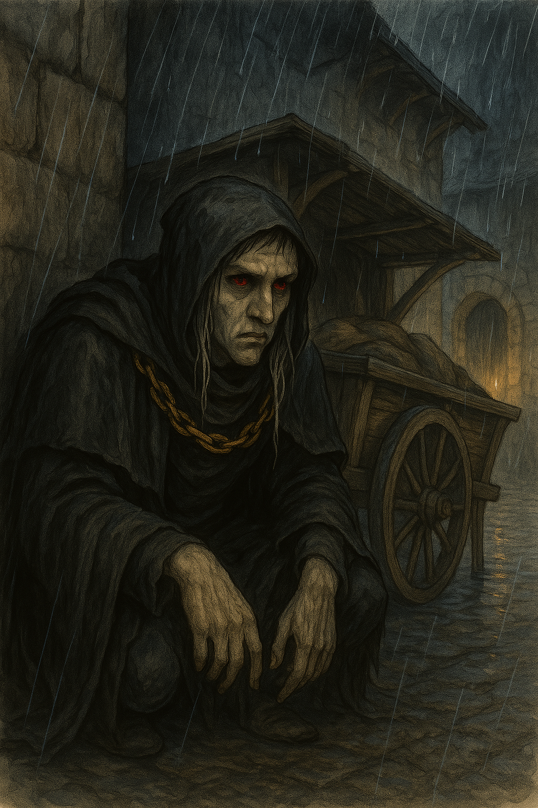

# Quin'taral

- **Alias**: Quin
- **Typ**: dnd-pc
- **Sichtbarkeit**: public
- **Status**: published
- **Spoiler-Level**: low
- **Tags**: dnd-pc, greyhawk-campaign

{: height="250" }

## Ueberblick

- **Spezies**: Drow Elf
- **Klasse**: Rogue (Wayfarer archetype)
- **Groesse**: 1,70 m
- **Hintergrund**: Urban outcast, moeglicherweise Urchin oder Exiled Scion
- **Markantes Feature**: Ausgepraegter Instinkt fuer Misstrauen gegenueber Adel und Autoritaet
- **Alter**: Fruehe 30er (jung fuer einen Elf, aber vom Leben gezeichnet)

## Iconic Sayings

- "Wenn Du dem Adel die Hand gegeben hast, zaehl danach deine Finger."

## History

Quin'taral stammt aus der Unterwelt und lebt seit Jahren als Aussenseiter in der Oberwelt. Fruehe Armut, Ausgrenzung und Verrat durch Maechtige haben ihn gepraegt. Daraus entstand ein Ueberlebenswille, der ihn zu einem geschickten, vorsichtigen und schwer greifbaren Weggefaehrten gemacht hat.

## Motivation und Ziele

- Oberflaechlich: Rache an den Verantwortlichen fuer den Sturz seiner Familie.
- Tiefer: Einen Ort finden, an dem Vertrauen moeglich ist.
- Am tiefsten: Beweisen, dass Loyalitaet mehr wert ist als Opportunismus.

## Beziehungen

- Beziehungen innerhalb der Gruppe entwickeln sich vorsichtig, aber stetig.

## Equipment

- Eyes of Minute Seeing

## Tags

- #dnd-pc
- #greyhawk-campaign
