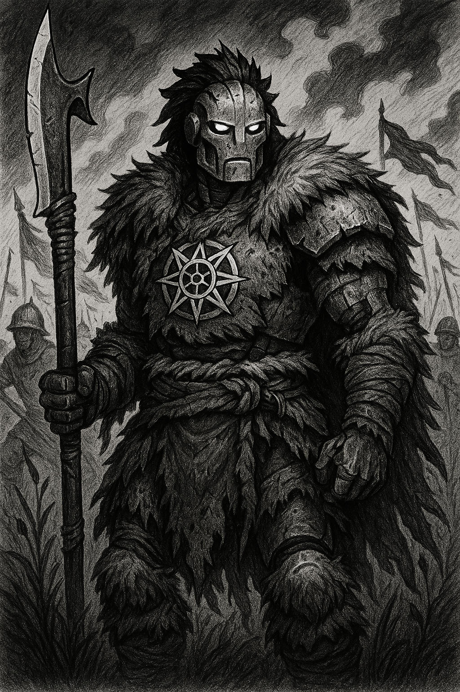

# Rex

{: height="250" }

## Überblick

- **Spezies**: Warforged
- **Klasse**: Barbar / Giants Path
- **Größe**: Mittelgroß (ca. 1,95 m)
- **Hintergrund**: Unbekannt; Rex sucht nach seiner Herkunft
- **Markantes Feature**: Siegel mit einem achtzackigen Stern auf der Brust; trägt ein Waffenarsenal; Lieblingswaffe: Gleve mit Reichweite
- **Alter**: wenige Jahre

## Iconic Sayings

- "Anweisung unklar. Ich schlage vor: Wir loesen das Problem direkt."

## History

- Rex ist ein Warforged mit unklarer Herkunft.
- Er kann Zwergisch verstehen.
- Er versucht, seine Vergangenheit und das Wesen der Menschen zu verstehen.

## Motivation und Ziele

- Suche nach seinem Hintergrund und seinen Erschaffern.
- Will Menschen verstehen.
- Versucht, den aktuellen Auftrag so direkt wie möglich abzuschließen.

## Beziehungen

- Greyhawk Adventure Party.
- Elinor Asbury.

## Journals

- [Character Journal 26-08-04 (Rex)](../journals/Character%20Journal%2026-08-04%20%28Rex%29.md)

## Equipment

- Circlet of near Human Perfection