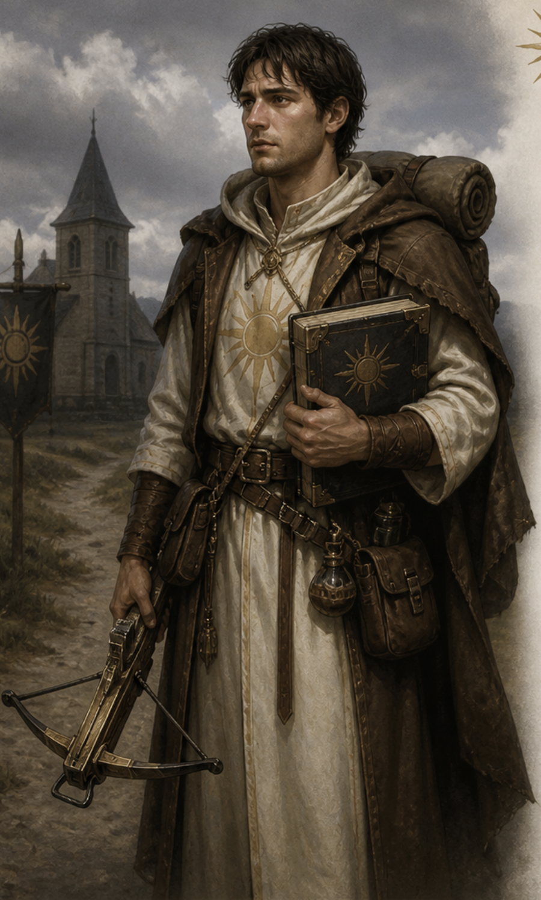

# Taran von Pennweg

- **Alias**: Taran

{: height="250" }

## Überblick

- **Spezies**: Human
- **Klasse**: Cleric
- **Größe**: 1,82 m
- **Hintergrund**: Aus Penwick von The Church of the Shining One (B-PEN-16)
- **Markantes Feature**: Gott Pelor
- **Alter**: 31 Jahre

## Iconic Sayings

- "Wenn noch Licht auf diesen Weg faellt, dann hat Pelor uns nicht verlassen."

## History

- Taran ist in Penwick aufgewachsen, einem kleinen, von Narben gezeichneten Ort in den südöstlichen Ebenen der Vizegrafschaft Verbobonc.
- Seine Eltern waren Söldner, die nach dem Angriff des Tempels des Elementaren Bösen Land angeboten bekamen und blieben.
- Als Kind war er ein stiller Außenseiter und wurde von Bischof Laimus gefördert.
- Taran wurde Gehilfe, Vertrauensmann und schließlich einziger Schüler von Laimus.
- Er pflegte den Schrein, heilte Kranke mit seinem Herbalism Kit und begleitete Laimus bei diplomatischen Bemühungen.
- In einer Meditationsnacht erhielt er eine Vision von Pelor und verließ Penwick mit seinem Rucksack, seinem Zensus und der alten Lichtarmbrust.

## Motivation und Ziele

- Menschen führen und heilen, wie in der Vision von Pelor.

## Beziehungen

- Johann Schueml, Wirt aus dem Gasthaus "The Ivy and Hearth", ist immer höflich zu ihm und schätzt seine Weisheit.
- Paul "ohne Schuhe" kann ihn nicht ausstehen, weil Taran gläubig ist.

## Journals

- Character Journal 19.05. (Taran)
- Character Journal 23.06. (Taran)

## Equipment

-