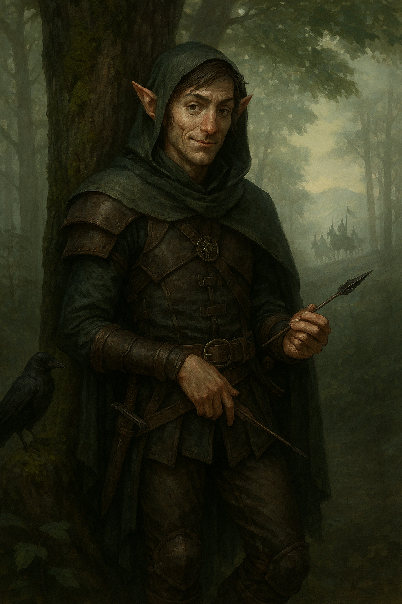

# Theren Dalanthan

- **Alias**: Theren

{: height="250" }

## Überblick

- **Spezies**: Elf (Wood Elf)
- **Klasse**: Ranger (Gloom Stalker)
- **Größe**: 1,83 m
- **Hintergrund**: Soldier
- **Markantes Feature**: Spaßvogel (Jester), nutzt Humor und Sarkasmus, um Unsicherheit zu überspielen
- **Alter**: 60 Jahre

## Iconic Sayings

- "Keine Sorge, ich habe einen Plan. Dass er schlecht ist, macht ihn nicht weniger zu einem Plan."

## History

- Geburtsort: Hookhill, The Gran March.
- Familienstand: ein angesehenes Familienhaus mit starken Verbindungen zum Militär.
- Geschwister:
  - Ein Geschwisterteil ist ein hochdekorierter Kavallerieoffizier bei den Rittern der Marsch.
  - Ein anderes Kind ist Berater von Kommandant Magnus Vrianian.
  - Ein drittes Kind könnte Priester des Heiligen Cuthbert sein.
- Wendung bei der Wehrpflicht: Statt in eine prestigeträchtige Kavalleriedivision wurde Theren in eine einfache Späher-Einheit versetzt.
- Alignment: Neutral Good.
- Rolle in der Gruppe: Scout, Infiltrator und stiller Beschützer.

## Motivation und Ziele

- Core conflict: struggle with self-worth and the pressure to prove themselves.
- Emotional drive: seeks recognition and independence.

## Beziehungen

- Garruk Baten, Stadtwächter.
- Borin Hausrat, Händler.

## Journals

-

## Equipment

- Sending stones of the 6